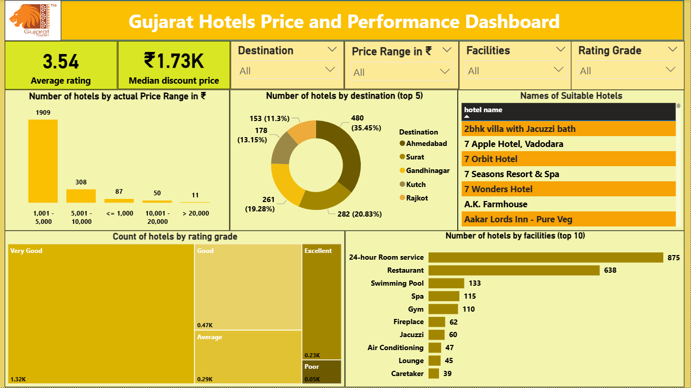

Gujarat Hotels Dashboard – Power BI
📌 Project Overview

This project is a Power BI dashboard analyzing hotels across major destinations in Gujarat, India. It provides insights into hotel prices, ratings, facilities, and location trends, while also including an interactive table of suitable hotel names based on filters — making it practical for tourists as well as valuable for hospitality industry stakeholders.

The goal of this project is to demonstrate data cleaning, modeling, DAX measures, and interactive dashboard design skills with a real-world use case.

🎯 Key Features

KPIs:

Average Hotel Rating (3.54)

Median Discount Price (₹1.73K)

Price Insights: Majority of hotels fall in the ₹1,001 – ₹5,000 price range.

Top 5 Destinations (using Power BI Top N filter):

Ahmedabad (35.5%), Surat (20.8%), Gandhinagar (19.3%), Kutch (13.1%), Rajkot (11.3%).

Demonstrates Top N filtering technique in Power BI.

Ratings Breakdown: Most hotels are rated Very Good.

Facilities Analysis: 24-hour Room Service and Restaurants are the most common amenities.

Hotel Finder Table: Displays actual hotel names dynamically based on user-selected filters (useful for tourists).

🛠️ Skills & Tools Demonstrated

Data Cleaning & Transformation – Preparing raw hotel dataset for analysis.

DAX Measures – Calculated KPIs such as Average Rating, Median Price, and Ratios.

Top N Filtering – Applied to highlight the top 5 destinations.

Interactive Dashboard Design – Filters by destination, price range, rating, and facilities.

Storytelling with Data – Translating analytics into business and user value.

📊 Dashboard Preview

🌍 Real-World Applications

Hospitality Industry: Identify competitive price ranges, key destinations, and facility trends.

Tourists: Quickly find hotels matching preferences (by budget, facilities, and rating).

Recruiters: Demonstrates ability to apply business intelligence, DAX modeling, and visualization techniques to solve real-world problems.
Tourists: Quickly find hotels matching preferences (by budget, facilities, and rating).

Recruiters: Demonstrates ability to apply business intelligence, DAX modeling, and visualization techniques to solve real-world problems.
